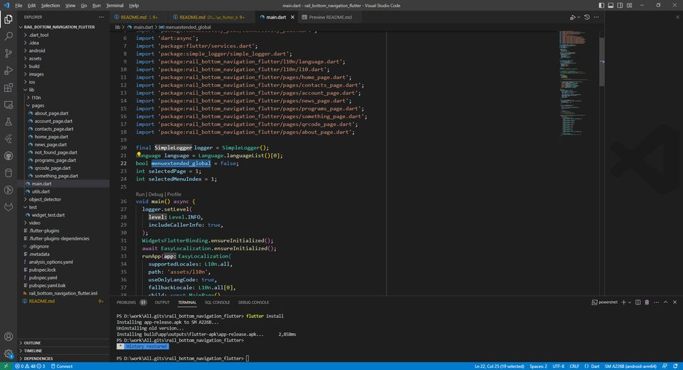

# BottomNavigationBar + NavigationRail + Language (easy_localization)

A new Flutter project.
 : [Flutter](https://flutter.dev/).<br>

## Getting Started

This project is a starting point for a Flutter application.<br>
I probed only Android platform.<br>

A few resources to get you started if this is first first Flutter project:<br>

- [Lab: Write your first Flutter app](https://docs.flutter.dev/get-started/codelab)<br>
- [BottomNavigationBar](https://api.flutter.dev/flutter/material/BottomNavigationBar-class.html?source=post_page)<br>
- [NavigationRail](https://api.flutter.dev/flutter/material/NavigationRail-class.html)<br>
- [Language (easy_localization)](https://pub.dev/packages/easy_localization)<br>
- [online documentation](https://docs.flutter.dev/)<br>

### Installing<br>
 : [Visual Studio Code](https://code.visualstudio.com/).<br>
IDE :
<div align="center">



</div><br>

Open Folder the rail_bottom_navigation_flutter directory.<br>
You connected you android mobil. Android version is >= 9. <br>
Debug version is in terminal windows:

```bash
./rail_bottom_navigation_flutter/android/local.properties:
sdk.dir=d:/Users/Appdata/Android/sdk  // overwrite this with the name of your own sdk.dir of directory.
flutter.sdk=d:\\ProgramFiles\\flutter // overwrite this with the name of your own flutter.dir of directory.
.
.

cd rail_bottom_navigation_flutter
```

In Run menu "Start Debuging" or "Run Without Debugging". <br>

Release version is in terminal windows: <br>

```bash
Flutter clean
flutter build apk
flutter install

// To the Google Play bundle file type and
// if your need the new key.properties, then 
// generating key create a file called key.properties in the android directory.
// this is need the for the bundle file.
// My key is good.
// https://dev.to/mimanjh/flutter-deploying-your-app-to-play-store-2nnc
// my batch file in ./key_tool/keytool.bat

flutter build appbundle 
```
YouTube video (click):<br>
<div align="center">

[](https://www.youtube.com/shorts/rHg8N2rDURE)

</div><br>
